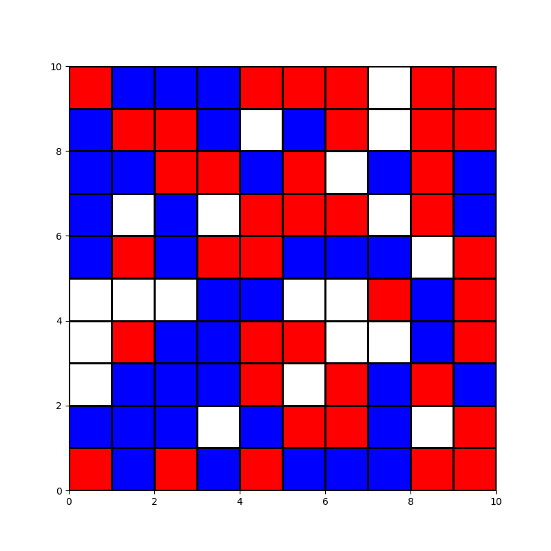

# The Schelling model of segregation - ABM

Schelling's model of segregation is an agent-based model developed by economist Thomas Schelling. The model is useful for the study of residential segregation of ethnic groups where agents represent householders who relocate in the city. This ,model, and its further development, brings to light two key questions: 
* segregation is local phenomena rather than global
* what prevents segregation from occurring on a large scale is that it occurs first on a smaller scale

This trend to self-segregation is recognizable in our cities, both in the community of migrant populations and in the original inhabitants, often resulting in this case in various forms of residential associations. It can therefore be said that, within certain limits, segregation strengthens the idea of the community as opposed to the phenomenon of social disintegration that characterizes large urban centers.

