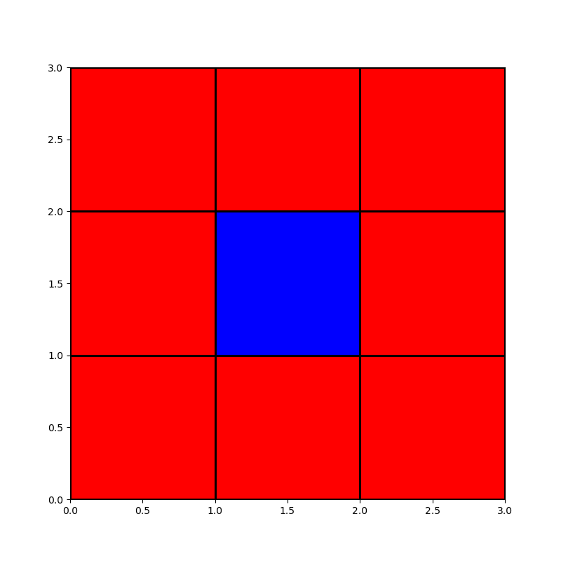

# The Schelling model of segregation - ABM

Schelling's model of segregation is an agent-based model developed by economist Thomas Schelling. The model is useful for the study of residential segregation of ethnic groups where agents represent householders who relocate in the city. This ,model, and its further development, brings to light two key questions: 
* segregation is local phenomena rather than global
* what prevents segregation from occurring on a large scale is that it occurs first on a smaller scale

This trend to self-segregation is recognizable in our cities, both in the community of migrant populations and in the original inhabitants, often resulting in this case in various forms of residential associations. It can therefore be said that, within certain limits, segregation strengthens the idea of the community as opposed to the phenomenon of social disintegration that characterizes large urban centers.

**The 2-D model**

The original model is set in an N × N grid. Agents are split into two types, say red and blue, and occupy the spaces of the grid and only one agent can occupy a space at a time. White spaces correspond to empty space, where agents can move. An example of random initial state is shown in the following image

Moving in an empty space occurs when the element is surrounded by less than a certain percentage (in our case arbitrary) of elements belonging to the same family, with respect to the total elements that surround it. For this simulation we consider just the first eight neighbors for each agent (see figure below)

The evolution of the system is the following. Let's start with a random position of agents and empty spaces. Then we let the system evolve. For each iteration each agents decide if stay in its position or change it based on the number of first neighbors. The simulation ends when all the elements of the grid are "happy", i.e. satisfied with the neighborhood. Sometime could happen that system doesn’t reach an equilibrium state.

in the figure below we can see different situation with different threshold. 

